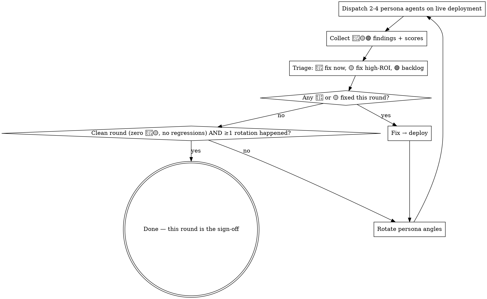

# Testing with Synthetic Users

Multi-round loop: persona agents with real motivations walk the live product, findings get triaged and fixed, the next round re-tests with fresh angles — until one full round comes back clean.

**Core principle: one-pass QA finds bugs; motivated personas find why users bounce. And a round that finds problems ends in fixes and a re-test — you are not done until a full round is green.**

## When to Use

- Feature is user-facing and reachable on production/staging
- You want breakage AND friction (confusion, dead ends, "can't find it") — not just crashes

**When NOT to use:** libraries/APIs with no user-facing surface (write integration tests instead); pre-implementation design validation (prototype instead).

## The Loop

Plan a round **budget** upfront and log it (typical 5; small surfaces can plan 2-3, high-risk more). The budget is a plan, not the exit condition — two rules override it in both directions:

- A round that found problems can never be the last round, even at budget. Extend.
- The sign-off round must follow at least one rotation — even if round 1 comes back clean, run one rotated round before signing off. A single angle can't validate itself.

## Setup

- **Host agent** (strongest model available) orchestrates, triages, fixes. **Persona agents** (mid-tier) browse and report.
- Personas use browser automation (Playwright / Chrome MCP) against the **real deployment** — never localhost when production/staging exists (localhost hides CDN, real data volume, auth, mobile networks).
- If features need login, pre-provision a pool of throwaway test accounts (never real user credentials); note them in the report.
- **Keep persona environments clean.** Host debugging must not leave residue (console errors, auth state, cookies) in a browser session personas share. When a finding looks unrelated to the feature under test, reproduce it in a fresh context before fixing — it may be test pollution, not a bug. Confirmed false positives go in the report as excluded, with the reason.
- **No browser automation available?** Degrade to API/CLI walkthroughs of the same user journeys — you keep data/logic findings but lose layout/discoverability fidelity. Say so in the report. If there's no journey to walk at all, this skill doesn't apply.

## Personas — Motivated Humans, Not QA Dimensions

A persona is a person with a goal and a knowledge gap. A QA dimension is a device or test category. Only the former finds "users can't find the feature":

- ✅ "Newcomer who can't read English product names, navigates by local-language names only"
- ✅ "Reseller comparing prices across variants hunting for mispriced items"
- ❌ "Mobile tester", "edge-case tester" — fold devices INTO personas: one persona runs their whole journey at 375px

**Deriving personas** — for each, answer: who are they, what do they want from this feature, what don't they know? Seed angles that generalize across products:

| Archetype | Finds |
|---|---|
| Newcomer with a language/domain-knowledge gap | Discoverability, jargon, missing onboarding |
| Power user with an efficiency goal | Workflow friction, missing shortcuts, data quality |
| Skeptic deciding whether to trust the product | Credibility gaps, inconsistent data, broken promises |
| Adversarial user probing limits (later rounds) | Input validation, concurrency, permission leaks |
| Returning user re-checking a previous complaint | Regressions, whether fixes actually landed |

**Rotate angles every round** — the same personas re-find the same blind spots. Later rounds add adversarial and regression personas; the final round is full-journey regression (desktop + mobile personas re-walking everything).

Ask personas to **score subjective qualities 1-10 with justification** (discoverability, trust, clarity). A feature that works but scores 3/10 on discoverability is a real 🟡 finding.

## Findings + Triage

| Level | Meaning | Triage |
|---|---|---|
| 🔴 | Broken: crash, dead link, wrong data shown | Fix immediately, this round |
| 🟡 | Friction: confusion, dead ends, low subjective scores | Fix high-ROI now; rest → backlog table |
| 🟢 | Idea / nice-to-have | Backlog; never blocks ship |

Findings need evidence: screenshots, console errors, failing URLs, repro steps. "Felt slow" without a trace is not a finding.

Don't substitute a pure bug-severity scale (P0-P3): it has no home for "works correctly but users bounce", so friction findings silently drop.

## Deliverable

Persist a report to `docs/` (or the project's doc dir) — findings that live only in chat evaporate. Use [report-template.md](report-template.md): round-by-round table (personas / findings / actions), final state, backlog table with severity, related commit chain. The report is the audit trail AND the sign-off.

## Case Studies

**Collectibles database, species-profile feature (5 rounds).** R1 personas caught wrong-type labels from dirty data and a price summary blown up by a single outlier record. R2's SEO-self-audit persona found 1,025 pages missing from the sitemap. R4's "discovery-path" persona scored the feature 3/10 on discoverability — technically perfect, but the only entry point was a small chip on a detail page; fix added two more entry points. R5: full regression clean, ship. A device-matrix test plan would have found none of R4.

**P2P trading feature (5 rounds, adversarial-heavy).** Personas probing as bad actors surfaced XSS in listings, a TOCTOU race in report handling, and admin-queue concurrency needing optimistic locking — across R1-R4, each round's fixes verified by the next. R5 clean.

## Common Mistakes

| Mistake | Reality |
|---|---|
| One-and-done: deliver a bug report, stop | The loop IS the method. Findings without the fix→retest cycle are a QA memo, not this skill. |
| QA-dimension personas ("mobile tester") | You'll catch crashes and miss "nobody can find it". |
| Same personas every round | Same blind spots every round. Rotate. |
| P0-P3 bug severity only | UX friction has no P-level; it silently drops. Use 🔴🟡🟢 + scores. |
| Skipping the clean final round | Fixes unverified in combination = not verified. Last round must be green. |
| Signing off on a clean round 1 | One angle validating itself. Rotate once, then sign off. |
| Treating every persona report as a product bug | Shared-browser residue and known transients produce false positives. Reproduce fresh, then triage. |
| Findings only in chat | No artifact → no backlog, no audit trail, learnings evaporate. |
| Testing localhost | Misses CDN, real data volume, auth, mobile-network reality. |
