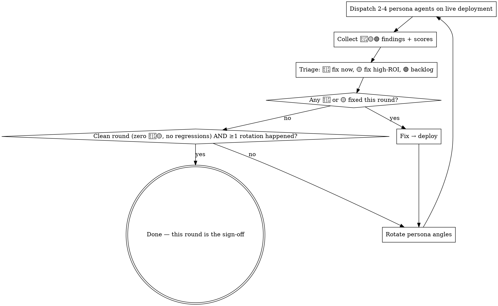

# Testing with Synthetic Users

Persona agents with real motivations walk the live product; findings get fixed and re-tested from fresh angles. One-pass QA finds bugs; motivated personas find why users bounce.

**You are not done until a full round comes back green.**

## When to Use — and Not

Use when a user-facing feature is reachable on production/staging and you want breakage AND friction (confusion, dead ends, "can't find it"). Not for:

- Libraries/APIs with no user journey → integration tests
- Pre-implementation design validation → prototype
- Trivial changes (copy tweak, config flip, one-line fix) → normal verification, no persona loop

## The Loop

Plan a round **budget** upfront (typical 5; small surfaces 2-3, high-risk surfaces more) and log it. The budget is a plan, not the exit condition:

- A round that found problems can never be the last round — extend past budget.
- Sign-off requires ≥1 rotation first — a single angle can't validate itself, even a clean round 1.
- **Forced to stop before a clean round** (time, access, environment)? The report states **NOT signed off** + what remains. Declared incompleteness is recoverable; a dirty round relabeled as done isn't.

## Setup

- Host agent (strongest model) orchestrates, triages, fixes; persona agents (mid-tier) browse via browser automation (e.g. Playwright / Chrome MCP) and report.
- Test the **real deployment**, never localhost when prod/staging exists — localhost hides CDN, real data volume, auth, mobile networks.
- Logins: pre-provision throwaway test accounts (never real credentials); note them in the report.
- **Isolate persona environments.** Parallel personas sharing one browser profile contaminate each other's storage and tabs — findings become artifacts. Give each an isolated profile/context, or run sequentially. Same for host residue: debug traces in a shared console read as bugs. Any finding that looks unrelated to the feature: reproduce in a fresh context before triaging; excluded false positives go in the report with the reason.
- **No browser automation?** (Native apps, browserless env.) Degrade the transport, never the method: walk the same journeys via the production API — still personas, rounds, rotation, triage, report. A "15/15 checks passed" smoke list is not this skill. You keep data/logic/auth findings but lose layout/discoverability fidelity — say so in the report. No journey to walk at all → skill doesn't apply.

## Personas — Motivated Humans, Not QA Dimensions

A persona is a person with a goal and a knowledge gap; a QA dimension is a device class. Only the former finds "users can't find the feature". To derive one, answer three questions: who are they, what do they want from this feature, what don't they know? ✅ "Newcomer who can't read English product names, navigates by local-language names only" · ❌ "mobile tester" — fold devices into personas (one persona walks their whole journey at 375px).

| Archetype | Finds |
|---|---|
| Newcomer with a language/domain gap | Discoverability, jargon, missing onboarding |
| Power user with an efficiency goal | Workflow friction, data quality |
| Skeptic deciding whether to trust | Credibility gaps, inconsistent data |
| Adversarial user probing limits (later rounds) | Validation, concurrency, permission leaks |
| Returning user re-checking a complaint | Regressions, whether fixes landed |

Rotate angles every round — same personas re-find the same blind spots. Later rounds add adversarial and regression personas; the sign-off round is full-journey regression, desktop AND mobile re-walking everything. Have personas score subjective qualities 1-10 with justification; a working feature scoring 3/10 on discoverability is a real 🟡.

## Findings + Triage

| Level | Meaning | Triage |
|---|---|---|
| 🔴 | Broken: crash, dead link, wrong data | Fix immediately, this round |
| 🟡 | Friction: confusion, dead ends, low scores | Fix high-ROI now; rest → backlog |
| 🟢 | Idea / nice-to-have | Backlog; never blocks ship |

Findings need evidence (screenshots, console errors, repro steps) — "felt slow" without a trace isn't a finding. Don't substitute P0-P3: a pure bug scale has no home for "works but users bounce", so friction silently drops.

## Deliverable

Persist a report to `docs/` — findings only in chat evaporate. Use [report-template.md](report-template.md): round-by-round table, final state, backlog, excluded false positives, commit chain, method & limitations. The report is the audit trail AND the sign-off. Real examples: [references/case-studies.md](references/case-studies.md).

## Common Mistakes

| Mistake | Reality |
|---|---|
| One-and-done: deliver a bug report, stop | The loop IS the method — findings without fix→retest is a QA memo |
| QA-dimension personas ("mobile tester") | Catches crashes, misses "nobody can find it" |
| Same personas every round | Same blind spots every round |
| Signing off on a clean round 1 | One angle validating itself — rotate once first |
| Skipping the clean final round | Fixes unverified in combination = not verified — the last round must be green |
| P0-P3 bug severity only | No home for "works but users bounce" — friction silently drops |
| Parallel personas, one browser profile | They contaminate each other; a whole round burns on artifacts |
| Treating every persona report as a bug | Residue and transients produce false positives — reproduce fresh first |
| Native app → API smoke checklist | Degraded transport still runs the full loop |
| Findings only in chat / testing localhost | No audit trail / missing CDN, data volume, auth reality |
